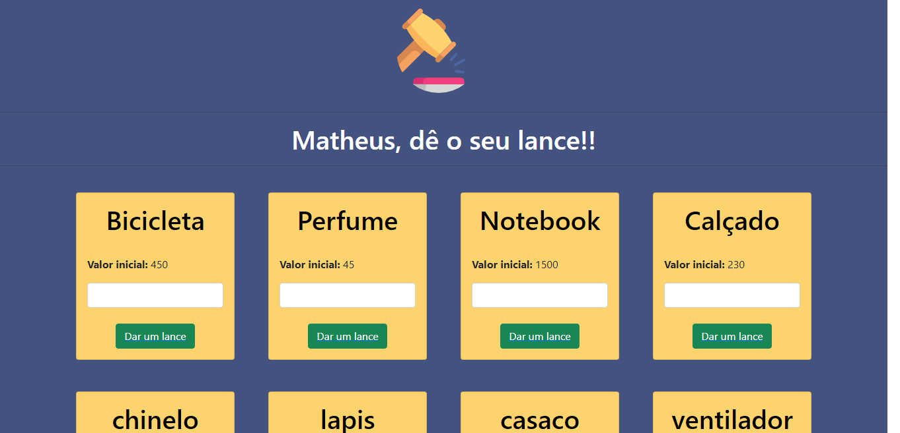

# leilao 👨‍⚖️

Teste do processo seletivo para estágio feito pela Graff Tecnologia.

## Tecnologias utilizadas:

<ul>
<li>Node JS</li>
<li>Express JS</li>
<li>Sequelize</li>
<li>EJS</li>
<li>Bootstrap 5</li>
</ul> 

  

 

## Instalação:

\*Processo para instalação das dependências do sistema após clone do repositório:

    npm install

## Configuração do banco de dados:

\*Na linha de comando no diretório da pasta, digite o código abaixo com seu usuário e senha do banco MYSQL da máquina.

        export DB_USERNAME=seuUsuario,
        export DB_SENHA=suaSenha,
        nodemon index.js

Após isso, vá ao navegador e digite:

    localhost:3030

## NOTAS

A documentação assim como refatoração do código serão feitos aos poucos, o intuito nesse teste foi testar os conhecimentos.
👷
